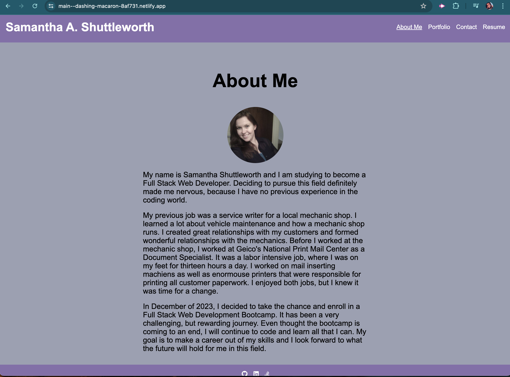
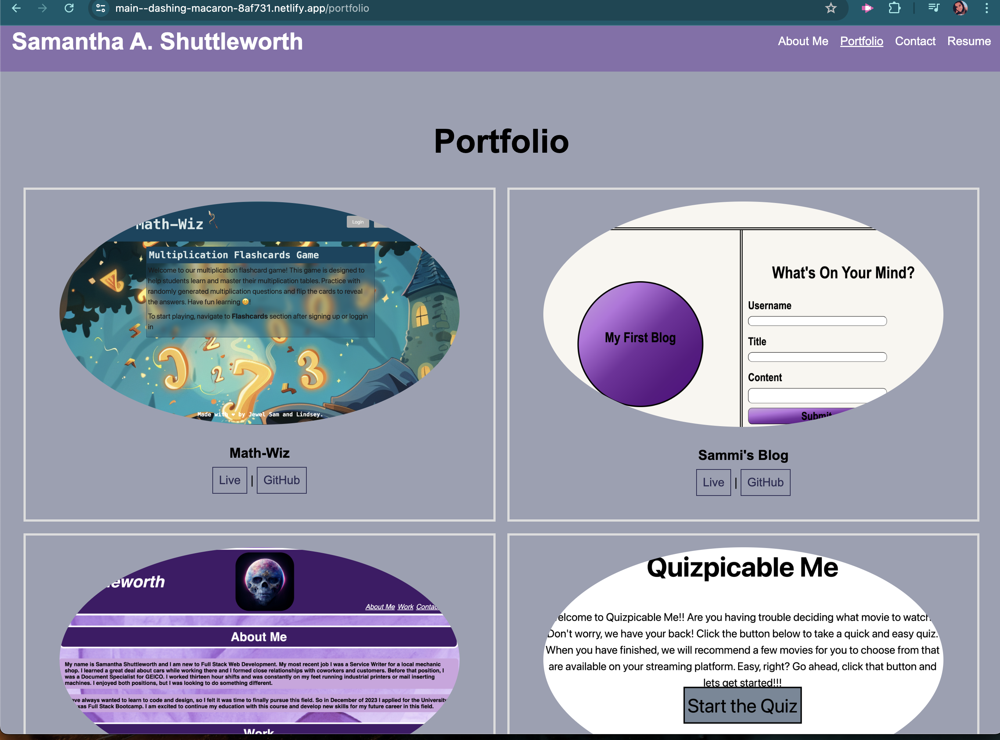
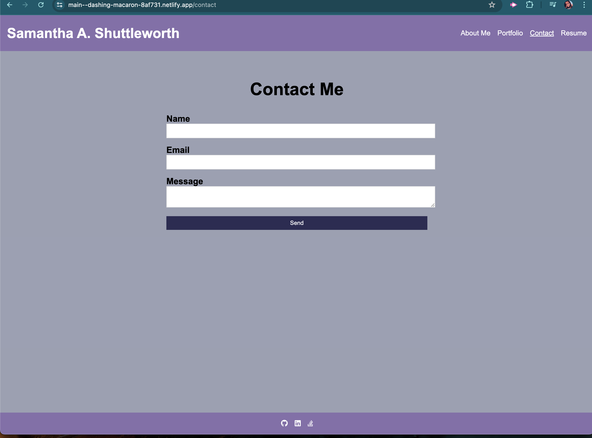
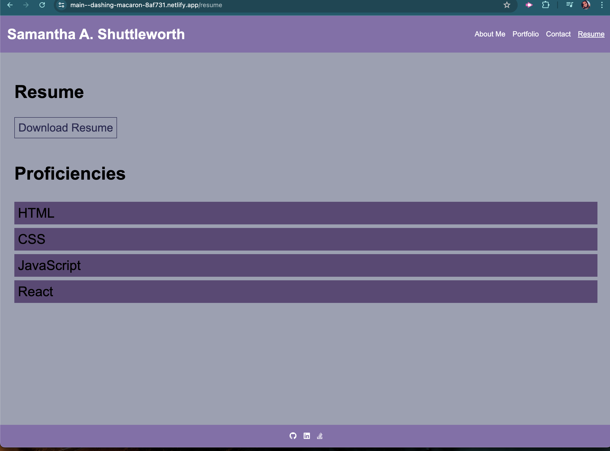

# reactportfolio2
Challenge 20 is a fully functioning React Application Portfolio. It will display a section about myself, a link that will take the user to my portfolio section with live links to the deployed projects and their related respositories.  The contact page will have a form that will allow the user to contact me.  Finall there is the resume page that should allow the user to download a copy of my resume and that page will also list what im proficient in.  At the bottom of the page are little icons for my Github, linkedin, and stack overflow accounts.

## Technologies & Resources Used
Visual Studio Code -This is the program used to write all the code for this challenge. Below are the links to the website and their license. https://code.visualstudio.com/ https://code.visualstudio.com/License/

Github- This program was used to upload my code so it is saved and others can view what I have done. Below are the links to the website and license. https://www.github.com https://docs.github.com/en/site-policy/github-terms/github-terms-of-service

Xpert Learning Assistant- The Xpert Learning Assistant is a chat AI program created by the Full-Stack Web Development program to assist students, like myself, with any questions they may have.

UT Class Repository - We referred back to several of our class lessons to help us build our application.

ChatGPT 3.5 -I used this AI to help further my understanding of back end coding. It helped with clarification from what Xpert Learning Assistant was giving me and I was still was not understanding. https://chat.openai.com/ https://openai.com/policies/terms-of-use

React- React lets you build user interfaces out of individual pieces called components. Create your own React components like Thumbnail, LikeButton, and Video. Then combine them into entire screens, pages, and apps. https://react.dev/

## Acknowledgements
I would like to acknowledge the resources that have been available for me to be able to accomplish this project.  This includes class recordings, class lessons, chat gpt, and xpert learning assistant. These tools helped me with being able to build and deploy my personal react portfolio.  I would also like to acknowledge Pedro Tech on youtube.  I was very confused even when asking the chat ai's.  Watching the beginning of his video tutorial helped clear up a lot of confusion I had for this project. 

## License 
MIT

## Links
https://main--dashing-macaron-8af731.netlify.app/

https://github.com/Sashuttle/reactportfolio2

## Screenshots

